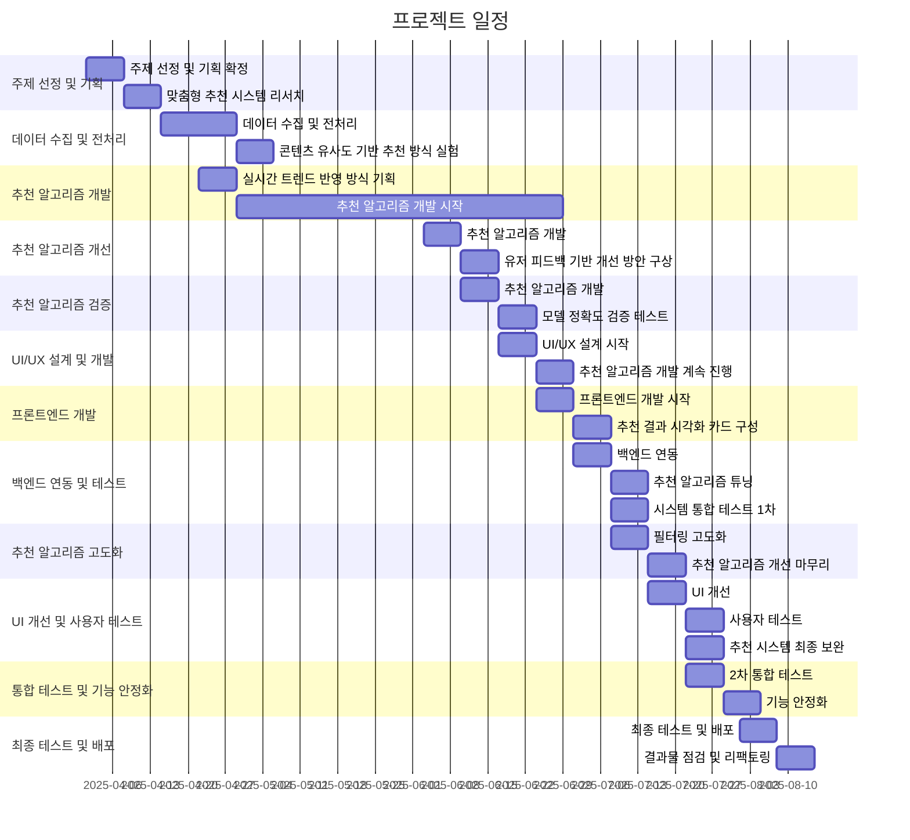

# 프로젝트 기획서

## 1. 프로젝트 개요
- 프로젝트 주제: **개인 취향을 반영한 맞춤형 OTT 콘텐츠 및 영화 추천 시스템 개발**
- 목표: **1. 사용자 선호 분석: 시청 이력, 장르 선호도 등을 반영한 개인 맞춤형 프로필 생성. 2. 실시간 트렌드 반영: 최신 인기 콘텐츠와 개인 취향을 조합하여 동적 추천 제공. 3. 사용자 인터페이스 구축: 직관적인 UI/UX 설계를 통해 개인화된 추천 목록 제공**
  
### 주요 소비층: 
- OTT 구독 후에 '볼 건 많은데 볼 건 없네' 라고 느낀 사람
- OTT 플랫폼 가운데 본인에게 딱 맞는 서비스를 찾지 못한 사람
### 기대 효과:
- 개인화된 콘텐츠 탐색 효율성 향상
- 사용자가 선호하는 콘텐츠를 빠르게 찾을 수 있어 검색 시간 절감
- 시청 경험 최적화 및 사용자 만족도 증가
- 사용자 참여도 및 OTT 플랫폼 이용률 증가
- 맞춤형 추천으로 시청 시간이 증가하고, 플랫폼 이탈률 감소
- 지속적인 관심 콘텐츠 제공으로 사용자 충성도 강화
- 다양한 콘텐츠 소비 촉진
- 기존에 몰랐던 콘텐츠를 추천받아 시청 폭 확대
- 비주류 영화, 독립 영화, 해외 작품 등의 노출 기회 증가

### 팀원 소개

<table align="center">
  <tr align="center">
    <td width="200px">
       
      

      <strong>김찬호</strong> 
      

      
    </td>
    <td width="200px">
       
      

      <strong>최동연</strong> 
      

      
    </td>
    <td width="200px">
       
      

      <strong>이성재</strong> 
      

      
    </td>
  </tr>
</table>

### 화면 구성:

  
  
  
  

  
  
  
  

## 📖 프로젝트 일정 Gantt :fire:

### 데이터 베이스 설계(ERD):

# 작업 분할 구조 (WBS)

## 1. 기획 📋
### 1.1 문제 정의 🔍
- 사용자 취향을 반영한 맞춤형 OTT 추천 시스템의 필요성 분석
- 기존 OTT 추천 시스템의 한계점 및 개선 방안 정리
- 목표 설정: 개인화된 추천 서비스 제공

### 1.2 데이터 요구사항 정의 📊
- 필요한 데이터 항목: 사용자 시청 이력, 장르 선호도, 콘텐츠 평점 등
- 데이터 유형 정의: 정형 데이터, 비정형 데이터
- 데이터 수집 방법 및 출처 선정

## 2. 데이터 수집 및 준비 🗃️
### 2.1 데이터 소스 조사 🌐
- OTT 플랫폼에서 제공하는 공개 API 또는 데이터셋 조사
- 타겟 데이터를 제공하는 제3자 데이터 소스 확인
- 데이터 소스 선정 및 수집 전략 수립

### 2.2 데이터 수집 및 저장 💾
- 필요한 데이터 수집: 시청 이력, 장르별 선호도, 사용자 피드백 등
- 데이터 저장소 설계: 데이터베이스 또는 클라우드 저장소 선정
- 데이터 수집 자동화 및 관리 시스템 구축

### 2.3 데이터 전처리 🧹
- 결측값 처리 및 이상치 제거
- 텍스트 데이터 정제: 불용어 처리, 토큰화 등
- 데이터 정규화 및 표준화 작업
- 전처리된 데이터 저장

## 3. 데이터 분석 및 모델링 📈
### 3.1 데이터 탐색 및 시각화 📊
- 기본 통계 분석: 평균, 분산, 빈도 분석 등
- 데이터 분포 시각화: 히스토그램, 박스플롯, 산점도 등
- 장르별 선호도 및 사용자 특성 분석

### 3.2 모델 선택 및 학습 🤖
- 추천 알고리즘 선택: 콘텐츠 기반 필터링, 협업 필터링 등
- 모델 학습: 훈련 데이터와 검증 데이터 분리, 교차 검증 실시
- 모델 튜닝 및 최적화

### 3.3 성능 평가 📊
- 모델 성능 평가 지표 정의: 정확도, 정밀도, 재현율 등
- 테스트 데이터셋을 이용한 모델 성능 평가
- 평가 결과에 따른 모델 개선 사항 도출

## 4. 결과 도출 및 보고 📑
### 4.1 결과 요약 📋
- 추천 시스템 성능 요약 및 결과 분석
- 사용자 맞춤형 추천 시스템의 개선점 및 강점 정리
- 프로젝트 목표 달성 여부 평가

### 4.2 보고서 작성 📝
- 전체 프로젝트 흐름 및 주요 작업 내용 정리
- 데이터 분석 및 모델링 과정, 결과 분석 포함
- 시스템 구현 및 테스트 과정 보고

### 4.3 최종 발표 🎤
- 프로젝트 결과 발표 준비: 발표 자료 준비, 발표 연습
- 최종 발표 및 데모 진행
- 발표 후 질의응답 및 피드백 반영

# 프로젝트 설계서

## 1. 시스템 아키텍처 🏗️

### 구성요소:

#### 1.1 데이터 수집 모듈 🛰️
- **OTT 시청 기록 데이터 수집**: 사용자 시청 이력, 장르 선호도, 콘텐츠 평점 데이터 수집
- **실시간 트렌드 데이터 수집**: OTT 플랫폼에서 제공하는 인기 콘텐츠 및 시청 트렌드 데이터 수집
- **사용자 피드백 수집**: 평점, 리뷰 및 추천 피드백 수집

#### 1.2 데이터 전처리 모듈 🔧
- **결측치 처리**: 결측값을 처리하고, 대체 방법 적용
- **이상치 제거**: 비정상적인 시청 패턴 및 데이터 제거
- **데이터 통합 및 표준화**: 다양한 소스에서 수집된 데이터를 표준 형식으로 변환
- **시청 이력 데이터 정리**: 사용자별 시청 패턴을 구조화하여 분석할 수 있도록 정리

#### 1.3 데이터 분석 및 시각화 모듈 📊
- **사용자 시청 패턴 분석**: 장르 선호도, 시청 시간 등 분석
- **콘텐츠 간 유사도 계산**: 장르, 출연진, 시청 패턴 등을 기반으로 콘텐츠 간 유사도 계산
- **추천 결과 시각화 및 UI/UX 제공**: 추천된 콘텐츠를 시각적으로 제공하는 직관적인 UI/UX 설계 (추후 제공)

---

## 2. 기술 스택 ⚙️

#### 2.1 데이터 수집 📝
- **Python, BeautifulSoup**: OTT별 프로그램 웹 데이터 크롤링
- **Open API 활용**: 방송통신위원회 방송통계포털 API 활용, OTT 플랫폼에서 제공하는 시청 이력 데이터 수집

#### 2.2 데이터 분석 🔍
- **Pandas, NumPy**: 데이터 전처리 및 분석
- **TensorFlow, Scikit-learn**: 추천 시스템 및 머신러닝 모델 학습 및 평가
- **XGBoost, LightGBM**: 추천 모델의 성능을 높이기 위한 앙상블 모델

#### 2.3 시각화 📈
- **Matplotlib, Seaborn, Plotly**: 데이터를 시각화하고 분석 결과를 직관적으로 표현
- **Dash**: 웹 기반 대시보드를 사용하여 사용자 인터페이스 제공

---

## 3. 예상 문제 및 해결 방안 ⚠️

#### 3.1 문제 1: 데이터 불균형 ⚖️
- **문제**: 특정 사용자군이나 특정 프로그램에 대한 시청 데이터가 과도하거나 부족하여 추천 결과의 정확도가 낮아질 수 있음
- **해결 방안**: 
  - **SMOTE(Synthetic Minority Over-sampling Technique)**: 데이터가 부족한 사용자군에 대해 가상 데이터를 생성하여 균형 맞추기
  - **데이터 증강**: 특정 사용자 그룹에 대한 데이터 증강 기법 활용

#### 3.2 문제 2: 실시간 트렌드 반영 어려움 ⏳
- **문제**: 실시간 트렌드 데이터를 빠르게 반영하여 동적인 추천을 제공하는 데 어려움이 있을 수 있음
- **해결 방안**: 
  - **Real-time Data Processing**: 실시간 데이터를 빠르게 처리하고 추천 알고리즘에 반영할 수 있는 스트리밍 데이터 처리 시스템 구축
  - **주기적인 배치 처리**: 데이터 분석을 주기적으로 실행하여 최신 트렌드를 반영하도록 개선

#### 3.3 문제 3: 모델의 과적합 🧠
- **문제**: 추천 알고리즘이 특정 사용자나 콘텐츠에만 적합하게 학습되어 다른 사용자에게는 부정확한 추천을 제공할 수 있음
- **해결 방안**: 
  - **교차 검증**: 데이터를 여러 부분으로 나누어 학습하고 검증하여 모델의 일반화 능력을 높임
  - **하이퍼파라미터 튜닝**: 과적합을 방지하기 위한 최적의 모델 파라미터 튜닝

#### 3.4 문제 4: 추천의 다각화 부족 🎭
- **문제**: 추천된 콘텐츠가 특정 장르나 트렌드에 집중되어 사용자가 다양한 콘텐츠를 탐색하지 못할 수 있음
- **해결 방안**: 
  - **다양한 콘텐츠 추천**: 장르, 출연진, 콘텐츠의 인기 등 다양한 요소를 고려하여 추천 시스템을 다각화
  - **사용자 피드백 반영**: 사용자 피드백을 분석하여 개인화된 추천을 더 넓은 범위에서 제공

---

## 4. 추가 사항 📋
- **UI/UX 설계**: 사용자가 추천 콘텐츠를 직관적으로 탐색하고 사용할 수 있도록 UI/UX 설계 및 개선 작업
- **추천 결과의 정확도 및 만족도 추적**: 추천 시스템의 성능을 지속적으로 모니터링하고, 사용자의 만족도를 추적하여 알고리즘을 개선하는 방안 마련
- **데이터 보호 및 개인정보 처리**: 사용자 데이터를 안전하게 보호하기 위한 보안 조치 및 개인정보 처리 방침 수립

