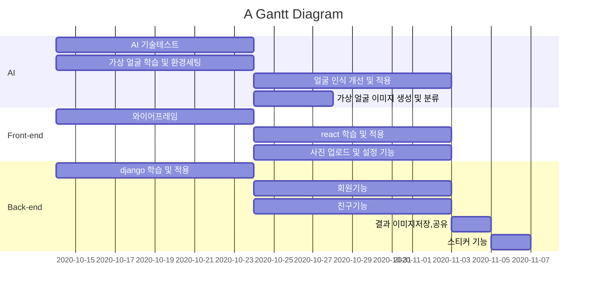

# 프로젝트 기획서

## 1. 프로젝트 개요
- 프로젝트 주제: **개인 취향을 반영한 맞춤형 OTT 콘텐츠 및 영화 추천 시스템 개발**
- 목표: **1. 사용자 선호 분석: 시청 이력, 장르 선호도 등을 반영한 개인 맞춤형 프로필 생성. 2. 실시간 트렌드 반영: 최신 인기 콘텐츠와 개인 취향을 조합하여 동적 추천 제공. 3. 사용자 인터페이스 구축: 직관적인 UI/UX 설계를 통해 개인화된 추천 목록 제공**
  
### 주요 소비층: 
- OTT 구독 후에 '볼 건 많은데 볼 건 없네' 라고 느낀 사람
- OTT 플랫폼 가운데 본인에게 딱 맞는 서비스를 찾지 못한 사람
### 기대 효과:
- 개인화된 콘텐츠 탐색 효율성 향상
- 사용자가 선호하는 콘텐츠를 빠르게 찾을 수 있어 검색 시간 절감
- 시청 경험 최적화 및 사용자 만족도 증가
- 사용자 참여도 및 OTT 플랫폼 이용률 증가
- 맞춤형 추천으로 시청 시간이 증가하고, 플랫폼 이탈률 감소
- 지속적인 관심 콘텐츠 제공으로 사용자 충성도 강화
- 다양한 콘텐츠 소비 촉진
- 기존에 몰랐던 콘텐츠를 추천받아 시청 폭 확대
- 비주류 영화, 독립 영화, 해외 작품 등의 노출 기회 증가

### 팀원 소개

<table align="center">
  <tr align="center">
    <td width="200px">
        
      <strong>김찬호</strong>  
      
    </td>
    <td width="200px">
        
      <strong>최동연</strong>  
      
    </td>
    <td width="200px">
        
      <strong>이성재</strong>  
      
    </td>
  </tr>
</table>

### 화면 구성:

  
  
  
  

  
  
  
  

### 📅 프로젝트 일정 (Gantt Chart)

| 주차   | 기간               | 주요 작업 내용                                                                 |
|--------|--------------------|------------------------------------------------------------------------------|
| 1주차  | 04.01 ~ 04.07      | 🔍 주제 선정 및 기획 확정 🧠 맞춤형 추천 시스템 리서치                             |
| 2주차  | 04.08 ~ 04.14      | 📊 사용자 데이터 구조 설계 📝 시청 이력/장르 기반 개인화 로직 기획                   |
| 3주차  | 04.15 ~ 04.21      | 📂 데이터 수집 및 전처리 🧪 콘텐츠 유사도 기반 추천 방식 실험                         |
| 4주차  | 04.22 ~ 04.28      | 🧠 실시간 트렌드 반영 방식 기획 🧩 추천 알고리즘 개발 시작                           |
| 5주차  | 04.29 ~ 05.05      | 🧩 추천 알고리즘 개발 📈 사용자-콘텐츠 매칭 로직 설계                                |
| 6주차  | 05.06 ~ 05.12      | 🧩 추천 알고리즘 개발 🔄 유저 피드백 기반 개선 방안 구상                             |
| 7주차  | 05.13 ~ 05.19      | 🧩 추천 알고리즘 개발 📊 모델 정확도 검증 테스트                                      |
| 8주차  | 05.20 ~ 05.26      | 🎨 UI/UX 설계 시작 🧩 추천 알고리즘 개발 계속 진행                                   |
| 9주차  | 05.27 ~ 06.02      | 💻 프론트엔드 개발 시작 📦 추천 결과 시각화 카드 구성                                |
| 10주차 | 06.03 ~ 06.09      | 🔗 백엔드 연동 🧩 추천 알고리즘 튜닝 🛠 시스템 통합 테스트 1차                    |
| 11주차 | 06.10 ~ 06.16      | 🧠 필터링 고도화 🧩 추천 알고리즘 개선 마무리                                        |
| 12주차 | 06.17 ~ 06.23      | 📱 UI 개선 🧪 사용자 테스트 🔧 추천 시스템 최종 보완                               |
| 13주차 | 06.24 ~ 06.30      | 📦 2차 통합 테스트 🧹 기능 안정화                                                    |
| 14주차 | 07.01 ~ 07.07      | 📋 기획서/문서 정리 📄 최종 발표 구조 설계 시작                                      |
| 15주차 | 07.08 ~ 07.14      | 🖼 포스터, 시연 자료 준비 📊 사용자 시나리오 보강                                   |
| 16주차 | 07.15 ~ 07.21      | 🎤 발표 리허설 🧹 시스템 정리 및 마무리                                               |
| 17주차 | 07.22 ~ 07.28      | 📦 최종 테스트 및 배포 📝 결과물 점검 및 리팩토링                                    |
| 18주차 | 07.29 ~ 07.31      | ✅ 최종 점검 및 제출 준비                                                               |
| 19주차 | 08.01 ~ 08.04      | 🎤 **최종 발표 및 데모 진행**                                                            |

## 📖 Gantt :fire:

### 데이터 베이스 설계(ERD):

